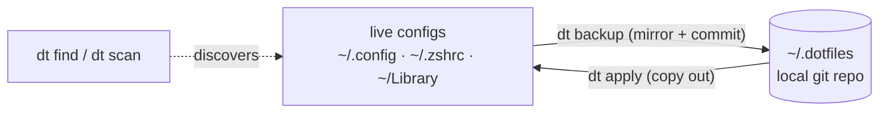

```
 ██████╗  ██████╗ ██╗   ██╗███████╗████████╗ █████╗ ██╗██╗
 ██╔══██╗██╔═══██╗██║   ██║██╔════╝╚══██╔══╝██╔══██╗██║██║
 ██║  ██║██║   ██║██║   ██║█████╗     ██║   ███████║██║██║
 ██║  ██║██║   ██║╚██╗ ██╔╝██╔══╝     ██║   ██╔══██║██║██║
 ██████╔╝╚██████╔╝ ╚████╔╝ ███████╗   ██║   ██║  ██║██║███████╗
 ╚═════╝  ╚═════╝   ╚═══╝  ╚══════╝   ╚═╝   ╚═╝  ╚═╝╚═╝╚══════╝
```

<div align="center">

### `FIND THE CONFIG // SNAPSHOT THE CONFIG // NEVER LOSE THE CONFIG`

*a dovetail joint for your dotfiles — live files on one side, a local git repo on the other, nothing symlinked in between*


-78716c?style=flat-square&labelColor=111111)


</div>

---

## 🪚 What is this

Every app on your machine keeps a config file somewhere — `~/.config`, a hidden rc file, a folder buried in `~/Library/Application Support` — and some keep none at all. dovetail (`dt`) answers the question first: `dt find <app>` probes the conventional locations and greps the app's man page for a FILES section. Once found, configs get mirrored into `~/.dotfiles`, a local git repository where every backup is a commit and every mistake is an undo.

The core model is deliberately boring: no symlink farms, no templates, no daemon. Your live files stay exactly where they are, and `dt` copies them in (`dt backup`) or out (`dt apply`) — which means hand-editing the store and pushing it live is the same operation as restoring a backup. A hardcoded secrets deny-list keeps your ssh keys, tokens, and shell history out of the repo. The store has no remote unless you add one yourself, and `dt push` only ever pushes to a remote that already exists — make it a private repository, because once the store leaves the machine the deny-list is the only thing protecting anything it missed.

It was designed for one user, one Mac, and zero patience for chezmoi's learning curve. It knows this about itself.

```console
nick@dovetail:~$ dt find lazygit
conventional paths:
  ~/Library/Application Support/lazygit  FOUND
[✓] config located. it was hiding in ~/Library, obviously.
[i] track it with: dt add lazygit <path>
```

## 🧩 The joinery

| | command | what it actually does |
|---|---|---|
| 01 | **`dt find <app>`** | what it actually finds — probes `~/.config`, `~/.<app>rc`, `~/Library`, then greps the man page and `--help` for path mentions |
| 02 | **`dt scan`** | sweeps `~/.config/*` and home dotfiles, auto-tracks everything that passes the guards — secrets, binaries, and >1MB junk stay out |
| 03 | **`dt backup [app]`** | mirrors live files into the store and commits — a no-op commit costs nothing, so the daily launchd job is free. pushes too, if you've given the store a remote |
| 04 | **`dt apply [app]`** | pushes store copies out to the live locations — hand-edit `~/.dotfiles`, run this, done |
| 05 | **`dt edit <app>`** | snapshot → `$EDITOR` → diff → snapshot. knows GUI editors lie about being done and appends `--wait` for you |
| 06 | **`dt undo <app>`** | restores the previous snapshot. run it twice and you've redone it (this is a feature, legally speaking) |
| 07 | **`dt diff [app]`** | live files vs last snapshot, straight from `git diff`. `--json` reports each file's state instead, for scripts |
| 08 | **`dt delete <app>`** | final snapshot, then removes an orphaned config from disk — refuses if any file was never snapshotted |
| 09 | **`dt open`** | opens the store in finder, for when you'd rather click |
| 10 | **conflict rule** | if live *and* store both changed since the last snapshot, dt refuses and makes you pick a direction — neither side silently loses |

## 🚀 Run it

You need [bun](https://bun.sh) and a Mac. That's the whole list.

```bash
git clone https://github.com/nitrimandylis/dovetail.git
cd dovetail
bun run compile   # → ~/.bun/bin/dt, man dt, and the agent skill
man dt            # the eleven commands + --force, offline
```

Then `dt scan` to track everything, `dt install-schedule` for a silent daily backup at noon, and forget it exists until the day you break your zshrc — which is the day it earns its keep.

## 🤖 The agent skill

`dovetail-cli/SKILL.md` is an agent skill for driving `dt` — that snapshotting comes before editing, why the conflict refusal is correct and what `--force` is really overriding, and that `undo` is a toggle rather than a stack. The traps that don't fit in `--help`, in other words. `bun run compile` copies it into `~/.claude/skills/` if you already have that directory, and leaves your machine alone if you don't.

It's a plain directory at the repo root rather than a `.claude/` one, because this repo is public and not everyone drives it with the same agent. Point yours at the file.

## 🔩 Under the hood



| file | job |
|---|---|
| `dt.ts` | the eleven commands, dispatch, and the safety refusals |
| `store.ts` | path mapping, manifest, git plumbing, deny-list, junk guards, mirrored copying |
| `discover.ts` | scan heuristics and the find engine (conventional paths + man-page grep) |
| `dt.test.ts` | six checks that fail if the parts that guard your data break |

**Stack:** bun · typescript · node stdlib · git via subprocess · launchd for scheduling

---

<div align="center">

**[Nick Trimandylis](https://github.com/nitrimandylis)**

`YOUR DOTFILES DESERVE A PAPER TRAIL`

</div>
